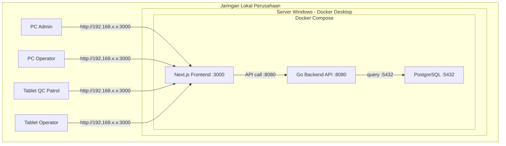

# Catatan Arsitektur CMWI - Internal Deployment

Dokumen ini berisi rangkuman arsitektur, tech stack, dan panduan deployment untuk project **CMWI (Quality Control Pandawara)** yang berjalan secara internal di jaringan lokal perusahaan.

---

## 1. Overview

- **Tipe**: Aplikasi internal perusahaan (tidak di-deploy ke hosting/cloud)
- **Akses**: Hanya dari jaringan lokal (LAN) perusahaan
- **Pengguna**: 20-100 user (operator QC, admin, quality assurance)
- **Perangkat**: PC admin, tablet operator (QC Patrol)
- **Deployment**: Docker di satu server Windows

---

## 2. Tech Stack

| Layer          | Teknologi          | Keterangan                                      |
| -------------- | ------------------ | ----------------------------------------------- |
| Frontend       | **Next.js 16**     | React 19, Tailwind CSS 4, Zustand, React Query  |
| Backend        | **Go (Gin)**       | REST API, performa tinggi, single binary         |
| Database       | **PostgreSQL**     | Reliable, JSONB support untuk roles              |
| Container      | **Docker Compose** | Orchestrasi semua service dalam satu command     |
| Reverse Proxy  | **Nginx** (opsional) | Satu port untuk FE + BE                        |

---

## 3. Diagram Arsitektur



### Alur Data

```
User (Browser) --> Next.js (SSR + Client) --> Go API (Gin) --> PostgreSQL
```

- **User** mengakses frontend via IP server di jaringan lokal
- **Frontend** mengirim request ke backend Go via `apiClient` (axios)
- **Backend** memproses logic, query database, return JSON
- **Database** menyimpan semua data (users, QC patrol, dsb.)

---

## 4. Struktur Project

```
CMWI/
├── ARCHITECTURE.md             # Dokumen ini
├── docker-compose.yml          # Orchestrator semua service
├── .env                        # Environment variables untuk docker-compose
│
├── fe-test1/                   # Frontend (Next.js)
│   ├── Dockerfile
│   ├── .env                    # NEXT_PUBLIC_API_URL
│   ├── package.json
│   ├── src/
│   │   ├── app/                # Next.js App Router (pages)
│   │   ├── components/         # React components
│   │   ├── lib/                # axios client, utilities
│   │   ├── stores/             # Zustand auth store
│   │   ├── context/            # Sidebar, Theme context
│   │   ├── hooks/              # Custom hooks
│   │   └── middleware.ts       # Auth redirect middleware
│   └── public/                 # Static assets (images, icons)
│
├── be-test1/                   # Backend (Go + Gin)
│   ├── Dockerfile
│   ├── go.mod
│   ├── go.sum
│   ├── main.go                 # Entry point
│   ├── .env
│   ├── config/                 # DB config, env loader
│   ├── models/                 # Struct / DB models
│   ├── handlers/               # HTTP handler functions
│   ├── middleware/              # Auth middleware (JWT)
│   ├── routes/                 # Route definitions
│   └── utils/                  # Helper functions (hash, token)
│
└── nginx/                      # (Opsional) Reverse proxy
    └── nginx.conf
```

---

## 5. Docker Deployment

### docker-compose.yml (Rancangan)

```yaml
services:
  db:
    image: postgres:16-alpine
    restart: unless-stopped
    environment:
      POSTGRES_USER: bosani
      POSTGRES_PASSWORD: 1234567890
      POSTGRES_DB: db_cmwi
    volumes:
      - pgdata:/var/lib/postgresql/data
    ports:
      - "5432:5432"               # Buka hanya jika perlu akses DB dari host
    networks:
      - internal

  backend:
    build: ./be-test1
    restart: unless-stopped
    depends_on:
      - db
    environment:
      DB_HOST: db
      DB_PORT: 5432
      DB_DATABASE: db_cmwi
      DB_USERNAME: bosani
      DB_PASSWORD: 1234567890
      JWT_SECRET: cmwi-secret-key-2026
      APP_PORT: 8080
    ports:
      - "8080:8080"               # Expose untuk frontend
    networks:
      - internal

  frontend:
    build: ./fe-test1
    restart: unless-stopped
    depends_on:
      - backend
    environment:
      NEXT_PUBLIC_API_URL: http://backend:8080
    ports:
      - "3000:3000"               # Port utama yang diakses user
    networks:
      - internal

volumes:
  pgdata:                          # Persistent volume untuk data PostgreSQL

networks:
  internal:
    driver: bridge
```

### Catatan Docker

- `restart: unless-stopped` -- service otomatis hidup setelah server reboot
- `pgdata` volume -- data PostgreSQL **tidak hilang** saat container dihapus/rebuild
- `depends_on` -- memastikan urutan startup (DB -> Backend -> Frontend)
- `networks: internal` -- semua container berkomunikasi via Docker internal network

---

## 6. Akses dari Jaringan Lokal

### Agar semua device di LAN bisa akses:

1. **Bind ke `0.0.0.0`**
   - Docker secara default sudah bind ke `0.0.0.0` saat mapping port
   - Artinya semua device di jaringan bisa akses via IP server

2. **Cek IP server**
   ```bash
   # Linux
   ip addr show
   # Windows
   ipconfig
   ```
   Contoh: server IP = `192.168.1.100`

3. **Akses dari device lain**
   ```
   http://192.168.1.100:3000
   ```

4. **Firewall Windows -- WAJIB buka port**
   ```powershell
   # Jalankan di PowerShell (Admin)
   New-NetFirewallRule -DisplayName "CMWI Frontend" -Direction Inbound -Port 3000 -Protocol TCP -Action Allow
   ```
   Hanya port **3000** yang perlu dibuka (FE). Port 8080 dan 5432 cukup internal antar container.

5. **(Opsional) Buat alias DNS lokal**
   - Tambahkan entry di DNS server perusahaan: `qc.cmwi.local -> 192.168.1.100`
   - Atau edit `hosts` file di setiap PC: `192.168.1.100  qc.cmwi.local`
   - Supaya user cukup akses: `http://qc.cmwi.local:3000`

---

## 7. Hal Penting yang Perlu Diperhatikan

### Data Persistence

- PostgreSQL data **wajib** pakai Docker volume (`pgdata`)
- Jangan pakai bind mount ke folder Windows (masalah permission)

### Backup Database

```bash
# Manual backup
docker exec cmwi-db-1 pg_dump -U bosani db_cmwi > backup_$(date +%Y%m%d).sql

# Restore
docker exec -i cmwi-db-1 psql -U bosani db_cmwi < backup_20260327.sql
```

Rekomendasi: buat scheduled task (Windows Task Scheduler) untuk backup otomatis harian.

### CORS di Backend Go

Backend harus allow origin dari IP server/domain frontend:

```go
// Contoh config CORS di Gin
r.Use(cors.New(cors.Config{
    AllowOrigins:     []string{"http://192.168.1.100:3000"},
    AllowMethods:     []string{"GET", "POST", "PUT", "DELETE", "OPTIONS"},
    AllowHeaders:     []string{"Authorization", "Content-Type"},
    AllowCredentials: true,
}))
```

### Timezone

Set timezone container ke WIB agar timestamp sesuai:

```yaml
# di docker-compose.yml, tambahkan di setiap service:
environment:
  TZ: Asia/Jakarta
```

### Environment Variables

- **JANGAN** hardcode credentials di source code
- Gunakan `.env` file yang **tidak di-commit ke git** (tambahkan ke `.gitignore`)
- Untuk production, bisa pakai Docker secrets atau `.env` file di server

### Security Jaringan Internal

- Meski internal, tetap gunakan **JWT** untuk auth
- Password di-hash dengan **bcrypt** di backend
- Refresh token disimpan sebagai **httpOnly cookie** (sudah di-setup di frontend)

---

## 8. Akun Mock (Sementara)

Saat ini frontend menggunakan mock API (tanpa backend) untuk development. File terkait:

- `fe-test1/src/lib/mock-data.ts` -- in-memory data store
- `fe-test1/src/app/api/auth/*` -- mock route handlers

### Kredensial Test

| Username   | Password       | Roles             |
| ---------- | -------------- | ----------------- |
| `admin`    | `admin123`     | admin, operator   |
| `operator` | `operator123`  | operator          |

### Cara Menghapus Mock (Ketika Backend Sudah Siap)

1. Ganti `fe-test1/.env`:
   ```
   NEXT_PUBLIC_API_URL=http://localhost:8080
   ```
2. Hapus file-file mock:
   ```
   rm fe-test1/src/lib/mock-data.ts
   rm -rf fe-test1/src/app/api/
   ```

---

## 9. Roadmap / Langkah Selanjutnya

### Fase 1: Backend API (be-test1)

- [ ] Inisialisasi project Go dengan Gin
- [ ] Setup koneksi PostgreSQL (GORM atau pgx)
- [ ] Buat endpoint auth: `/auth/login`, `/auth/register`, `/auth/refresh`, `/auth/logout`
- [ ] Buat endpoint user: `/user/profile`
- [ ] Implementasi JWT (access token + refresh token)
- [ ] Implementasi bcrypt untuk password hashing
- [ ] Setup CORS middleware

### Fase 2: Dockerize

- [ ] Buat `Dockerfile` untuk `fe-test1` (multi-stage build Next.js)
- [ ] Buat `Dockerfile` untuk `be-test1` (multi-stage build Go binary)
- [ ] Buat `docker-compose.yml` di root CMWI
- [ ] Test semua service berjalan via `docker compose up`

### Fase 3: Integrasi

- [ ] Hapus mock API dari frontend
- [ ] Arahkan `NEXT_PUBLIC_API_URL` ke backend container
- [ ] Test login/register dari frontend ke backend
- [ ] Test akses dari device lain di jaringan lokal

### Fase 4: Fitur Bisnis

- [ ] Endpoint CRUD untuk QC Patrol
- [ ] Endpoint untuk Painting, Machining
- [ ] Dashboard analytics
- [ ] Export data (PDF/Excel)

### Fase 5: Production Hardening

- [ ] Setup backup otomatis PostgreSQL
- [ ] Logging (structured logs di backend)
- [ ] Health check endpoint (`/health`)
- [ ] Monitoring sederhana (uptime, disk usage)
