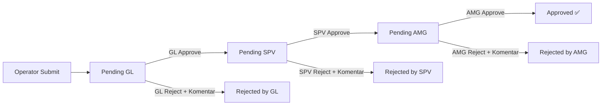

# Fitur Approval Berjenjang: GL → SPV → AMG

Menambahkan sistem persetujuan 3 tahap untuk setiap painting inspection. Setiap level approver bisa menyetujui (OK) atau menolak dengan catatan/komentar.

## Flow Approval



- Saat operator submit → status otomatis **"Pending GL"**
- GL approve → status berubah ke **"Pending SPV"**
- SPV approve → status berubah ke **"Pending AMG"**
- AMG approve → status menjadi **"Approved"**
- Di setiap level, jika reject → wajib isi komentar, status menjadi **"Rejected by GL/SPV/AMG"**

## User Review Required

> [!IMPORTANT]
> **Status Default Berubah**: Saat ini default status saat operator submit adalah `"Pending SPV"`. Ini akan berubah menjadi `"Pending GL"` karena GL adalah level approval pertama. Data existing yang sudah ada di database akan tetap memiliki status lama dan tidak terdampak crash, tapi mungkin perlu di-update manual jika diperlukan.

> [!IMPORTANT]
> **Pertanyaan**: Apakah user yang login saat ini sudah memiliki role GL/SPV/AMG? Jika belum, kita perlu menambahkan role tersebut di user seeding. Untuk sekarang, saya akan membuat tombol approve/reject muncul berdasarkan role user yang login dan level approval yang sedang aktif.

## Proposed Changes

### Backend: Model Approval

#### [NEW] [approval.go](file:///Users/deryvery/Documents/DATA%20DERY/PINDAH%20ASLI/Proj/CMWI/CMWI/be-cmwi/models/approval.go)

Membuat model baru `Approval` untuk menyimpan riwayat persetujuan:

```go
type Approval struct {
    ID              uint      `gorm:"primaryKey" json:"id"`
    InspectionID    uint      `gorm:"not null;index" json:"inspection_id"`
    Role            string    `gorm:"size:20;not null" json:"role"`         // "GL", "SPV", "AMG"
    Action          string    `gorm:"size:20;not null" json:"action"`       // "approved", "rejected"
    Comment         string    `gorm:"type:text" json:"comment"`             // Wajib jika rejected
    ApprovedBy      uint      `gorm:"not null" json:"approved_by"`
    ApproverName    string    `gorm:"size:100" json:"approver_name"`
    CreatedAt       time.Time `json:"created_at"`
}
```

---

#### [MODIFY] [painting.go (model)](file:///Users/deryvery/Documents/DATA%20DERY/PINDAH%20ASLI/Proj/CMWI/CMWI/be-cmwi/models/painting.go)

- Ubah default `Status` dari `"Pending SPV"` → `"Pending GL"`
- Tambah relasi `Approvals []Approval`

---

### Backend: Handler & Routes

#### [MODIFY] [painting.go (handler)](file:///Users/deryvery/Documents/DATA%20DERY/PINDAH%20ASLI/Proj/CMWI/CMWI/be-cmwi/handlers/painting.go)

- Ubah default status saat `CreatePaintingInspection` dari `"Pending SPV"` → `"Pending GL"`
- Ubah `UpdatePaintingStatus` menjadi endpoint `ApprovePaintingInspection` yang:
  1. Menerima `action` ("approved"/"rejected") dan `comment`
  2. Otomatis menentukan level berikutnya berdasarkan status saat ini
  3. Membuat record `Approval` baru
  4. Update status inspection
- Tambah `GetPaintingApprovals` untuk fetch riwayat approval per inspection
- Ubah `GetPaintingInspection` agar preload `Approvals`

#### [MODIFY] [routes.go](file:///Users/deryvery/Documents/DATA%20DERY/PINDAH%20ASLI/Proj/CMWI/CMWI/be-cmwi/routes/routes.go)

Tambah route:
```
PUT  /painting-inspections/:id/approve  → ApprovePaintingInspection
GET  /painting-inspections/:id/approvals → GetPaintingApprovals
```

#### [MODIFY] [main.go](file:///Users/deryvery/Documents/DATA%20DERY/PINDAH%20ASLI/Proj/CMWI/CMWI/be-cmwi/main.go)

Tambah `&models.Approval{}` di `AutoMigrate`

---

### Frontend: Table & Detail Drawer

#### [MODIFY] [TablePainting.tsx](file:///Users/deryvery/Documents/DATA%20DERY/PINDAH%20ASLI/Proj/CMWI/CMWI/fe-cmwi/src/app/%28admin%29/%28others-pages%29/qc-patrol/_component/TablePainting.tsx)

1. **Tambah kolom "APPROVAL" di header table** (antara STATUS dan ACTIONS):
   - Menampilkan 3 ikon/badge kecil: GL | SPV | AMG
   - Masing-masing berwarna hijau (✓ approved), merah (✗ rejected), atau abu-abu (belum/pending)

2. **Tambah Interface `Approval`** di bagian TypeScript interface

3. **Tambah section "Daftar Persetujuan" di Detail Drawer**:
   - Tampil di bawah section Komentar
   - Format seperti gambar referensi: avatar inisial, nama, role, status, tanggal
   - Jika ada komentar rejection, tampilkan di bawah entry-nya

4. **Tambah tombol Approve/Reject di Drawer** (jika user punya role yang sesuai):
   - Tombol "Setujui" (hijau) dan "Tolak" (merah)
   - Jika tolak → muncul text area untuk input komentar
   - Setelah aksi → refresh data

## Open Questions

> [!IMPORTANT]
> 1. **Role User**: Apakah user yang ada sudah punya role `gl`, `spv`, `amg`? Atau mau saya buatkan seeding user baru untuk testing?
> 2. **Rejected Flow**: Jika sudah di-reject oleh GL, apakah operator bisa submit ulang (re-submit) atau data harus dibuat baru?
> 3. **Notifikasi**: Untuk sekarang, operator melihat status approval dari dashboard tabel. Apakah ada mekanisme notifikasi lain yang diinginkan?

## Verification Plan

### Automated Tests
- Restart backend `go run .` untuk trigger AutoMigrate tabel `approvals`
- Test approve flow via browser: submit data → GL approve → SPV approve → AMG approve
- Test reject flow: GL reject dengan komentar → verifikasi status di tabel

### Manual Verification
- Verifikasi kolom APPROVAL di tabel menampilkan badge yang benar
- Verifikasi detail drawer menampilkan riwayat persetujuan
- Verifikasi tombol approve/reject muncul sesuai role user
